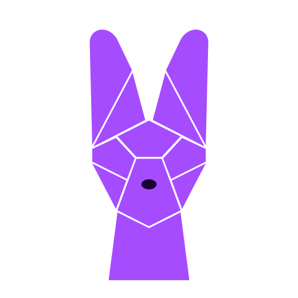

# Serval-net (Front-end)

## Table of contents

- [Description](#desc)
  - [Current features](#current-features)
  - [Planned features](#planned-features)
- [Installation](#installation)
- [Usage](#usage)
- [Demo](#demo)
- [Technologies & Tools](#tools)
- [License](#license)

<a id="desc"></a>

## Description

Serval-net is a social media platform allowing users to share their thoughts with other users.
Currently it is in the early stage of the development, having limited number of functions available for use. Demo version is available at this [link](https://serval-net-client.vercel.app/).

<a id="current-features"></a>

### Current features

Current features include:

- User authentication and authorization.
- Ability to create short posts and delete them.
- Ability to access other users' pages and see their posts.

<a id="planned-features"></a>

### Planned features

As this is the earliest usable version of the app, it will grow over time, and each new version will include more features. Some of the planned improvements:

- Ability to follow users and access feed page, where all new posts will be displayed.
- Extended post manipulation, including editing.
- Like and comment system.
- Design improvements.

<a id="installation"></a>

## Installation

1. Download or clone the repository:

   ```
   $ git clone https://github.com/devmikh/serval-net-client.git
   ```

2. Go to the project folder and install the dependencies:

   ```
   $ cd serval-net-client
   $ npm install
   ```

3. Make a copy of `.env.local.example` file, rename it to `.env.local` and provide your server's url. For example:

   ```
   SERVER_URL="http://localhost:3030"
   ```

4. Start the server
   ```
   $ npm run dev
   ```

<a id="usage"></a>

## Usage

This client should be used together with the [back-end of Serval-net application](https://github.com/devmikh/serval-net-server), which will handle requests and manipulate the database.

<a id="demo"></a>

## Demo Link

Try out a deployed version of the app by following this link:

https://serval-net-client.vercel.app/

<a id="tools"></a>

## Technologies & Tools

- [React](https://reactjs.org/)
- [Next.js](https://nextjs.org/)
- [Typescript](https://www.typescriptlang.org/)
- [Redux Toolkit](https://redux-toolkit.js.org/)

<a id="license"></a>

## License

This project is licensed under the MIT License - see the LICENSE file for details.
